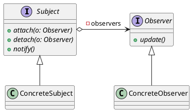

Observer Pattern
================

觀察者模式的 keypoint 在於通知與接受通知的過程

Story
-----

有一份工作叫佈署，佈署需要文件才能執行

```php
interface Worker
{
    // 佈署總是需要文件
    public function deploy($document);
}
```

今天公司只有一個工程師 Alex 會做佈署。

```php
class Alex implements Worker
{
    public function deploy($document)
    {
        echo "文件是這樣的，", $document, PHP_EOL;
        echo "已執行完畢", PHP_EOL;
    }
}
```

Boss 對佈署深感興趣－－畢竟是直接的利益關係者－－，他希望佈署完能通知他，於是 deploy 的流程被修改了

```php
class Alex implements Worker
{
    public function deploy($document)
    {
        echo "文件是這樣的，", $document, PHP_EOL;
        echo "已執行完畢", PHP_EOL;
        
        // 通知 Boss ，老闆想宣傳
        $boss = new Boss();
        $boss->propaganda();
    }
}
```

然後行銷跟客戶也對佈署感興趣，也都希望能通知， Alex 的流程完全被打亂了

```php
class Alex implements Worker
{
    public function deploy($document)
    {
        echo "文件是這樣的，", $document, PHP_EOL;
        echo "已執行完畢", PHP_EOL;
        
        // 通知 Boss ，老闆想宣傳
        $boss = new Boss();
        $boss->propaganda();

        // 通知 Marketing ，行銷想準備下次要做的東西
        $marketing = new Marketing();
        $marketing->prepare();
        
        // 通知 Customer ，客戶想使用服務
        $customer = new Customer();
        $customer->useService();
    }
}
```

Alex 最後爆走，提議：不如我做一個公告，你們有興趣自己過來看

```php
// 看公告的方法
interface Watch {
    public function watch();
}

// 每個人都會看公告
class Boss implements Watch {
    public function watch() {
        $this->propaganda();
    }
    public function propaganda() {
        echo "我是 Boss ，我想宣傳", PHP_EOL;
    }
}

class Marketing implements Watch {
    public function watch() {
        $this->prepare();
    }
    public function prepare() {
        echo "我是 Marketing ，我想提早準備", PHP_EOL;
    }
}

class Customer implements Watch {
    public function watch() {
        $this->useService();
    }
    public function useService() {
        echo "我是 Customer ，我想使用服務", PHP_EOL;
    }
}
```

最後大家想知道佈署最新狀況的話，再跟 Alex 說一聲即可

```php
class Alex implements Worker
{
    private $watcher = [];

    public function deploy($document)
    {
        echo "文件是這樣的，", $document, PHP_EOL;
        echo "已執行完畢", PHP_EOL;
        
        // 公告
        foreach ($this->watcher as $watcher) {
            $watcher->watch();
        }
    }
    
    public function addWatcher(Watch $watcher)
    {
        $this->watcher[] = $watcher;
    }
}

$worker = new Alex();
$worker->addWatcher(new Boss());
$worker->addWatcher(new Marketing());
$worker->addWatcher(new Customer());

// 佈署了
$worker->deploy('git pull 就對了');
```

### Definition

觀察者模式的定義

> Define a one-to-many dependency between objects so that when one object changes state, all its dependents are notified and updated automatically.

定義物件之間的一對多關係，使得一個物件改變狀態時，所有倚賴於它的物件都會得到通知並且自動被更新。

#### Context

* 物件狀態異動的頻率無法預料。
* 為了達到狀態一致性而將物件緊密耦合在一起，將會降低物件的重複使用性。
* 不能限制資料相依物件的個數，可能有任意數量的物件都有興趣想要知道物件的狀態。
* 當某物件狀態改變時，其相依物件必須適時自動被通知。

> 此參考 [Teddy 大師的文章](http://teddy-chen-tw.blogspot.tw/2013/08/observer-pattern.html)

#### UML

通用類別圖如下：


Plantuml 程式碼



各角色定義

* *Subject* 被觀察者，它必需要能夠動態的 `增加` 、 `取消` 和 `通知` 觀察者，通常是抽象類別或實作類別
* *Observer* 觀察者，在接收到被觀察者的通知時，對接受到的訊息做處理
* *ConcreteSubject* 具體的被觀察者，定義自己的業務邏輯，並定義對哪些事件做通知
* *ConcreteObserver* 具體的觀察者，每個觀察者在收到消息後的處理回應是不同的，各自有各自的邏輯

### How to Extends

物件耦合是在抽象層，所以只要有實作抽象，都可以互相耦合。想要擴展被觀察者或觀察者都很容易

### Reference

[Teddy - 重新整理Observer Pattern](http://teddy-chen-tw.blogspot.tw/2013/08/observer-pattern.html)
